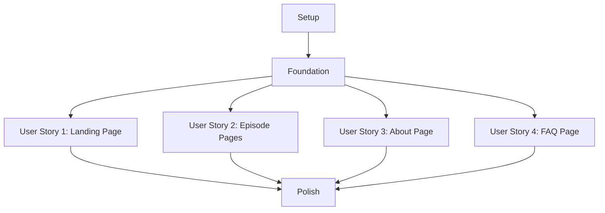

# Modern Podcast Website Implementation Tasks

## Dependencies Graph

## Phase 1: Setup

- [x] T001 Initialize Next.js project with TypeScript in src/
- [x] T002 Set up project structure according to implementation plan
- [x] T003 [P] Install and configure ESLint and Prettier
- [x] T004 [P] Set up Three.js and React Three Fiber dependencies
- [x] T005 [P] Configure styled-components with TypeScript
- [x] T006 Install required development dependencies
- [x] T007 Create base configuration files (tsconfig.json, next.config.js)
- [x] T008 [P] Set up static folder structure for mock data
- [x] T009 Configure static site generation settings

## Phase 2: Foundation

- [x] T010 Create base layout components in src/components/layout/
- [x] T011 [P] Set up responsive design system in src/styles/
- [x] T012 [P] Create Three.js canvas wrapper component in src/components/three/Canvas.tsx
- [x] T013 Create navigation component in src/components/layout/Navigation.tsx
- [x] T014 [P] Set up mock data generator for episodes in scripts/generate-mock-data.ts
- [x] T015 Generate 20 mock episodes with metadata
- [x] T016 Create shared types in src/types/
- [x] T017 [P] Set up image optimization configuration
- [x] T018 Create base page wrapper with SEO in src/components/layout/Page.tsx

## Phase 3: User Story 1 - Landing Page

- [ ] T019 [US1] Create 3D hero section component in src/components/three/HeroScene.tsx
- [ ] T020 [P] [US1] Create featured episode card component in src/components/episodes/FeaturedCard.tsx
- [ ] T021 [P] [US1] Create episode grid component in src/components/episodes/EpisodeGrid.tsx
- [ ] T022 [US1] Create landing page in src/pages/index.tsx
- [ ] T023 [US1] Implement responsive layout for landing page
- [ ] T024 [US1] Add 3D animations and interactions for hero section
- [ ] T025 [US1] Optimize 3D scene for mobile devices

## Phase 4: User Story 2 - Episode Pages

- [ ] T026 [US2] Create episode detail page template in src/pages/episodes/[id].tsx
- [ ] T027 [P] [US2] Create audio player component in src/components/player/AudioPlayer.tsx
- [ ] T028 [P] [US2] Create episode metadata display in src/components/episodes/EpisodeDetail.tsx
- [ ] T029 [US2] Implement show notes section with markdown support
- [ ] T030 [US2] Add sharing functionality
- [ ] T031 [US2] Create related episodes component in src/components/episodes/RelatedEpisodes.tsx
- [ ] T032 [US2] Implement responsive design for episode pages

## Phase 5: User Story 3 - About Page

- [ ] T033 [US3] Create about page template in src/pages/about.tsx
- [ ] T034 [P] [US3] Create 3D decorative elements for about page in src/components/three/AboutScene.tsx
- [ ] T035 [P] [US3] Create team section component in src/components/about/Team.tsx
- [ ] T036 [US3] Add contact form component in src/components/about/ContactForm.tsx
- [ ] T037 [US3] Implement responsive design for about page
- [ ] T038 [US3] Add animations and transitions

## Phase 6: User Story 4 - FAQ Page

- [ ] T039 [US4] Create FAQ page template in src/pages/faq.tsx
- [ ] T040 [P] [US4] Create FAQ category component in src/components/faq/Category.tsx
- [ ] T041 [P] [US4] Create FAQ item component with animation in src/components/faq/Item.tsx
- [ ] T042 [US4] Implement search/filter functionality
- [ ] T043 [US4] Add category-based organization
- [ ] T044 [US4] Create contact section for additional questions
- [ ] T045 [US4] Implement responsive design for FAQ page

## Phase 7: Polish & Cross-cutting Concerns

- [ ] T046 Implement site-wide search functionality
- [ ] T047 [P] Add loading states and animations
- [ ] T048 [P] Optimize images and 3D assets
- [ ] T049 Implement error boundaries
- [ ] T050 Add 404 and error pages
- [ ] T051 [P] Implement SEO optimizations
- [ ] T052 Perform accessibility audit and fixes
- [ ] T053 Optimize for Core Web Vitals
- [ ] T054 Add analytics integration
- [ ] T055 Perform cross-browser testing
- [ ] T056 Perform mobile device testing
- [ ] T057 Create production build and deployment documentation

## Implementation Strategy

### MVP Scope
- Phase 1: Complete setup
- Phase 2: Foundation
- Phase 3: Landing page with featured episode
- Phase 4: Basic episode pages with audio player

### Parallel Execution Opportunities

#### Setup Phase
- ESLint/Prettier setup can run in parallel with Three.js configuration
- Static folder structure setup can run in parallel with other configurations

#### Foundation Phase
- Design system setup can run in parallel with Three.js components
- Mock data generation can run in parallel with component creation

#### User Stories
- Component creation can be parallelized within each story
- 3D elements can be developed alongside regular components
- Styling can be done in parallel with component structure

### Independent Test Criteria

#### User Story 1 - Landing Page
- Hero section loads and animates correctly
- Featured episode displays with all metadata
- Episode grid shows correct number of episodes
- All elements are responsive

#### User Story 2 - Episode Pages
- Audio player functions correctly
- Episode metadata displays properly
- Show notes render markdown correctly
- Sharing functionality works

#### User Story 3 - About Page
- All sections display correctly
- 3D elements load and animate
- Contact form validates and shows success state
- Page is responsive

#### User Story 4 - FAQ Page
- Categories display and filter correctly
- Search functionality works
- FAQ items expand/collapse properly
- Contact section works

Total Tasks: 57
- Setup: 9 tasks
- Foundation: 9 tasks
- US1 (Landing Page): 7 tasks
- US2 (Episode Pages): 7 tasks
- US3 (About Page): 6 tasks
- US4 (FAQ Page): 7 tasks
- Polish: 12 tasks

Parallel Opportunities: 21 tasks marked with [P]

